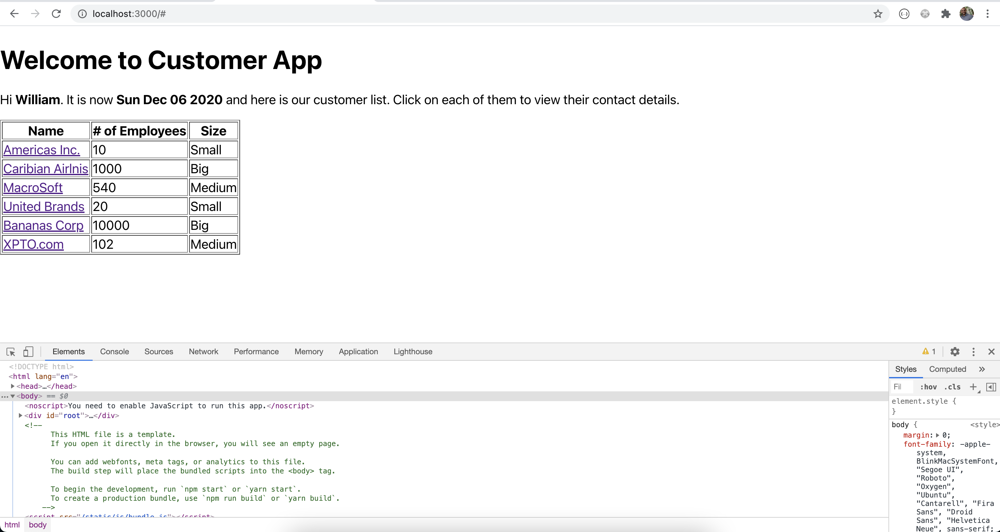
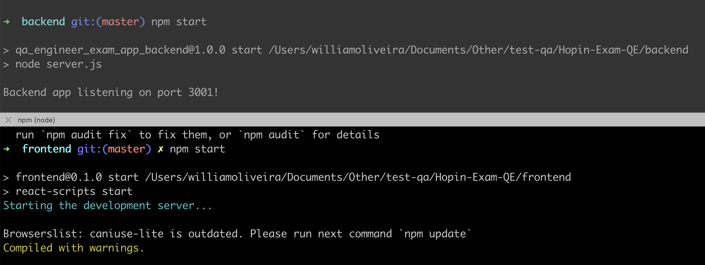

## Task 1: Test Environment Setup ##

Is is very important for a Test Engineer to be able to create a test environment following the instructions written by the developers. Therefore, you'll have to take the following steps:
1) Clone the repository;
2) Follow the **TestEnvironment.md** instructions to build and start the Customer App web application that you will be responsible to test;
3) After the app is running, fill the name field in the first screen, hit Submit and take a screenshot of the page showing your name and the current date; and 
4) Create a new public git repository, and commit and push the screenshot to it's root.

## Task 1 - Resolution
After completed the setup of frontend and backend it was possible to see both apps running.

Please use the following screenshots to see the results:

